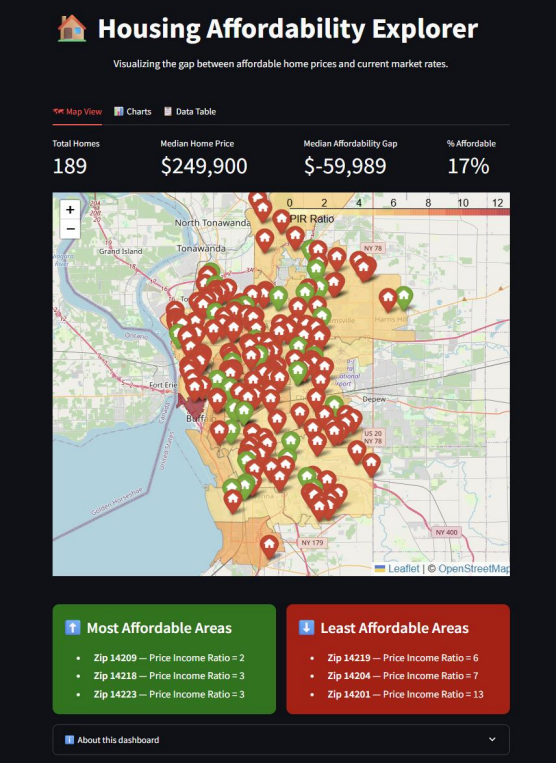
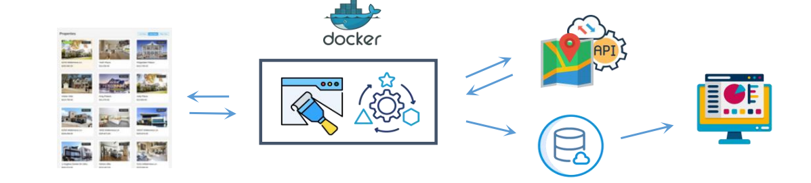
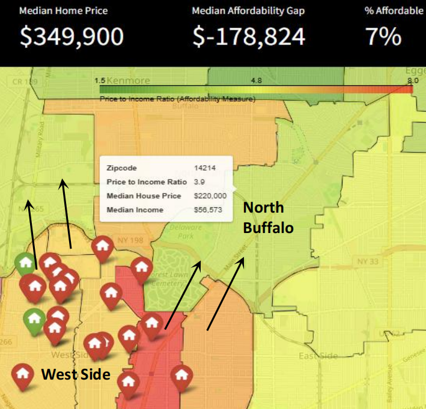

# Housing Affordability & Displacement Risk Monitoring System

## Summary

An end-to-end, automated housing analytics system designed to monitor affordability and identify emerging displacement risk at the neighborhood level. 

This project integrates real-time housing listings with affordability metrics and geospatial analysis to create a continuously updating decision-support tool. By transforming live market data into interpretable indicators of housing cost burden, the system enables policymakers, nonprofits, and community stakeholders to better understand where housing pressures are most acute and where intervention may be needed.

##

    

  

---

## Problem Statement

City governments, housing advocates, and community organizations often lack timely, granular data on housing affordability. While public datasets (e.g. Census/ACS) provide valuable insights, they are typically lagged and do not capture rapidly changing market conditions.

At the same time, housing affordability is a primary driver of displacement risk, yet it is often analyzed using static or aggregated indicators that obscure neighborhood-level dynamics.

This project addresses that gap by building an automated pipeline that:

- Collects real-time housing market data  
- Translates listing-level data into affordability metrics  
- Visualizes afforability burden on a neighborhood level

The result is a system that supports **continuous monitoring of affordability conditions**, enabling more responsive and targeted policy and planning decisions.

---

## System Overview

### Data Pipeline

    

### Core Components

- **Automated Scraper**  
  Collects real-time housing listings using Selenium.

- **Affordability Metrics Engine**  
  Computes key indicators such as:
  - Price-to-Income Ratio
  - Pricing Affordability Gap

- **Geospatial Enrichment**  
  Converts addresses into coordinates and enables spatial aggregation and mapping.

- **Cloud Data Layer**  
  Airtable serves as a lightweight, flexible backend for storing and updating processed data.

- **Interactive Dashboard**  
  Streamlit application visualizing:
  - Zip code-level affordability (choropleth)
  - Property-level listings (map markers)
  - Dynamic filtering and exploration tools  

---

## Methods

### Feature Engineering

Listing-level data is transformed into policy-relevant indicators, including:

- Affordability ratios relative to income  
- Price per square foot  

Zip code-level aggregates are computed to support neighborhood-level analysis.

---

### Affordability Metrics

Metrics are used to capture different dimensions of housing accessibility:

- **Price-to-Income Ratio**  
  Evaluates long-term affordability of homeownership.

- **Affordability Gap**  
  Highlights difference between affordable home prices and actual property listing prices.

These metrics allow for both **household-level and neighborhood-level analysis**.

---

### Geospatial Analysis

- Address-level geocoding via OpenStreetMap  
- Aggregation at the zip code level  
- Choropleth mapping of affordability indicators  
- Overlay of property-level data for micro-to-macro comparison  

This enables identification of **spatial patterns in affordability and housing pressure**.

---

## Key Findings

- Housing affordability varies significantly across neighborhoods, even within the same city.  
- High-cost burden areas tend to cluster spatially, indicating localized affordability pressures.  
- Listing-level data reveals emerging trends faster than traditional public datasets.  
- Certain neighborhoods show early signals of potential displacement risk based on rising cost burdens.  

---

## Outputs

Primary artifacts produced:

- Interactive Streamlit dashboard with:
  - Zip code-level affordability choropleth  
  - Property-level mapping with tooltips  
- Processed dataset of housing listings with affordability metrics  
- Automated pipeline for continuous data updates  

---

## Policy Relevance

This system provides a **transparent, data-driven framework** for understanding housing affordability in near real time.

Potential applications include:

- Identifying neighborhoods at risk of displacement  
- Supporting zoning and affordable housing policy decisions  
- Informing nonprofit housing advocacy and grant proposals  
- Guiding community outreach and resource allocation  

The tool is designed to bridge the gap between **raw housing data and actionable policy insight**.

### Sample Insight: 

  

  Buffalo’s West Side residents (zipcodes 14201, 14213, 14222) are facing high cost burdens and displacement pressures, with only 7% of listed properties affordable to the neighborhood’s median household. Many are at risk of being priced out and relocating to more affordable adjacent neighborhoods such as North Buffalo, where median house prices are $130k lower.

---

## Deployment & Automation

- Dockerized pipeline for reproducibility and portability  
- GitHub Actions used for:
  - Scheduled scraping runs  
  - Manual execution of data updates  
- Airtable enables lightweight cloud storage and easy integration with dashboards  

---

## Limitations & Future Work

- Current analysis is descriptive; future work will include:
  - Predictive displacement risk modeling  
  - Integration with socioeconomic and demographic datasets  
  - Scenario analysis for policy interventions  
  - Expansion to multiple cities  

---

## Tech Stack

**Data Processing / Engineering**
- Python
- Selenium
- Requests
- Pandas

**Geospatial Analysis**
- OpenStreetMap API
- Folium / Leaflet

**Storage**
- Airtable

**Visualization**
- Streamlit

**Deployment**
- Docker
- GitHub Actions
